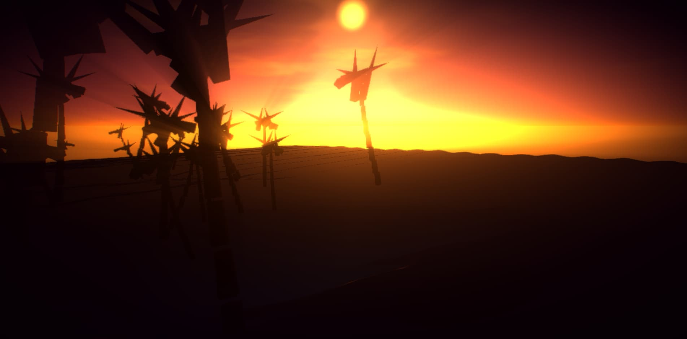

<br/>
<div >

# Sunset Beach


### *A cinematic interactive experience built with Three.js*


*Waves crashing on the shore. Palm trees swaying in the breeze.*
*A sun saying goodbye, and two thousand fireflies that don't know night is coming.*


</div>

---

<br/>

## Index

<details>
<summary><strong>Explore sections</strong></summary>

<br/>

1. [The Vision](#-the-vision)
2. [How It Works](#-how-it-works)
3. [Technical Decisions](#-technical-decisions)
4. [Architecture](#-architecture)
5. [GLSL Shaders](#-glsl-shaders)
6. [Render Pipeline](#-render-pipeline)
7. [Performance](#-performance)
8. [Installation](#-installation)
9. [Controls](#-controls)
10. [Customization](#-customization)
11. [Browser Support](#-browser-support)
12. [Contributing](#-contributing)
13. [Credits](#-credits)
14. [License](#-license)

</details>

---

<br/>

## The Vision

> *It's not a Three.js demo. It's a moment suspended in time.*

Sunset Beach captures that fleeting instant when the sun touches the horizon and everything turns golden. Waves break with infinite patience, palm trees whisper, and the sand still holds the warmth of the day.

The scene doesn't aim to be realistic — it aims to *feel* real.

Every shader, every particle, every frame is designed to evoke an emotion: **calm, wonder, presence**.

<br/>

### Layers of the Scene

```
    ☁️  Sunset Sky
    │   Volumetric clouds lit from below
    │
    🌊  Animated Ocean
    │   Breaking waves · Foam · Sun glint · Caustics
    │
    🏖  Procedural Beach
    │   Dry/wet sand · Shells · Dunes · Tide marks
    │
    🌴  Palm Trees
    │   Curved trunks · Wind-blown leaves · Coconuts
    │
    ✨  Particles
        2000 golden fireflies floating
```

---

<br/>

## How It Works

The experience is built on **five fundamental systems**, each running independently but synchronized in a 60 FPS animation loop.

### 1. Procedural Terrain

A 60×60 unit plane with 16,384 vertices. Elevation is calculated in the **vertex shader** using Simplex noise across multiple frequencies:

```
Beach (z < 0)          →  flat surface sloping toward the sea
Dunes (z > 5)          →  gentle undulations with fbm
Tide marks             →  subtle relief where water meets sand
```

The **fragment shader** blends dry and wet sand colors based on distance to water, adding granular variation and scattered shells.

### 2. Animated Ocean

4 wave frequencies combine in the vertex shader:

| Frequency | Purpose |
|---|---|
| `0.3 rad/s` | Large wave approaching shore |
| `1.5 rad/s` | Wave breaking at the coast |
| `4.0 rad/s` | Small chop (surface agitation) |
| `Simplex noise` | Organic irregular shape |

The fragment shader calculates sky reflection, specular sun glint, underwater caustics, and white foam where waves break.

### 3. Sunset Sky

A 200-radius sphere with **BackSide rendering**. The fragment shader generates:

- 4-color gradient (horizon → mid → zenith → ground)
- Volumetric clouds with FBM noise
- Lateral cloud lighting (silver lining)
- Sun disc with halo and horizontal rays
- Sun reflection over the water

### 4. GPU-Instanced Particles

2000 fireflies rendered with **a single draw call** using `InstancedMesh`. Each particle has:

- Individual position, scale, speed, and phase (instanced attributes)
- Floating movement calculated in vertex shader
- Firefly-style brightness pulse in fragment shader
- Warm palette colors (gold, orange, cream)

### 5. Post-Processing

7 passes chained in `EffectComposer`:

```
Render → Bloom → God Rays → Chromatic Aberration → Vignette → Color Grading → FXAA
```

Each pass is an independent `ShaderPass` that can be toggled on or off.

---

<br/>

## Technical Decisions

> *Why it wasn't done another way.*

### Why custom shaders instead of built-in materials?

Three.js standard materials (`MeshStandardMaterial`, etc.) are great for generic PBR scenes. But this scene requires:

- **Animated vertex displacement** on the terrain (wind ripple)
- **Waves** that change shape every frame
- **Color blending** based on water distance in real time
- **Clouds** generated procedurally

None of these are possible with predefined materials without hacks like `onBeforeCompile`, which hurt maintainability.

### Why `InstancedMesh` for particles?

Creating 2000 individual `THREE.Mesh` objects would mean 2000 draw calls per frame. With `InstancedMesh`, all particles render in **a single call**. Animation happens in the shader, not in JavaScript.

### Why `FogExp2` instead of linear `Fog`?

Exponential fog produces a more natural visibility falloff with distance. On a beach, salty mist creates exactly this effect: nearby objects are crisp, distant ones dissolve gradually.

### Why `OrbitControls` instead of animated camera?

Giving the user control creates a stronger connection with the scene. Auto-rotate maintains the sense of motion when idle, but stops immediately on interaction.

---

<br/>

## Architecture

Each system is an **independent class** with a clear contract:

```javascript
class System {
  constructor(scene, resourceManager) { /* init */ }
  update(elapsedTime, delta) { /* every frame */ }
  dispose() { /* free resources */ }
}
```

### Module Diagram

```
main.js  ─────────────────── Orchestrator
    │
    ├── core/
    │   ├── SceneManager.js       Scene · Camera · Renderer
    │   ├── PostProcessing.js     7-pass pipeline
    │   └── ResourceManager.js    GPU resource tracking & disposal
    │
    ├── environment/
    │   ├── Terrain.js            Procedural beach (GLSL)
    │   ├── Water.js              Ocean with waves (GLSL)
    │   ├── Sky.js                Sunset sky (GLSL)
    │   └── Fog.js                Volumetric fog
    │
    ├── lighting/
    │   └── LightingManager.js    Sun · Hemisphere · Ambient · Backlight
    │
    ├── effects/
    │   ├── Particles.js          GPU-instanced fireflies
    │   ├── Trees.js              Procedural palm trees
    │   └── Wind.js               Wind controller
    │
    └── utils/
        └── Noise.js              Simplex 3D (CPU)
```

### ResourceManager

All GPU resources (geometries, materials, textures, render targets) are tracked on creation and automatically freed on `beforeunload`:

```javascript
resourceManager.trackGeometry(geometry);
resourceManager.trackMaterial(material);
resourceManager.trackTexture(texture);
// ...
resourceManager.dispose();  // Safely frees everything
```

---

<br/>

## GLSL Shaders

Shaders are the heart of this experience. All visual movement happens on the GPU.

### Beach — Multi-layer displacement

```glsl
// Vertex: 4 noise layers combine
float beachSlope  = smoothstep(-15.0, 20.0, pos.z) * 2.5;
float dunes       = fbm(vec3(pos.x * 0.15, pos.z * 0.1, 0.0)) * 1.5;
float tideMarks   = sin(pos.x * 3.0 + pos.z * 0.5) * 0.05 * tideMask;
float windRipple  = sin(windPhase) * uWindStrength * 0.02;

pos.y = beachSlope + dunes + tideMarks + windRipple;
```

### Water — Beach waves

```glsl
// 4 frequencies + organic noise
float approach   = sin(pos.x * 0.3 + uTime * 0.7) * uWaveHeight;
float breaking   = sin(pos.x * 1.5 + uTime * 1.5) * uWaveHeight * shoreProximity;
float chop       = sin(pos.x * 4.0 + pos.z * 3.0 + uTime * 2.5) * 0.05;
float noiseWave  = snoise(vec3(pos.x * 0.2, pos.z * 0.2, uTime * 0.3)) * 0.15;
```

### Sky — Volumetric clouds

```glsl
// Lateral cloud lighting
float cloudSun = max(dot(normalize(cloudDir), normalize(uSunDirection)), 0.0);
vec3 cloudLit  = mix(vec3(1.0, 0.45, 0.1),   // Lit side
                     vec3(0.25, 0.08, 0.15),   // Shaded side
                     1.0 - pow(cloudSun, 0.4));

// Silver lining
float edgeGlow = pow(cloudSun, 10.0) * cloudDensity * 0.6;
```

### Fireflies — Brightness pulse

```glsl
// Fragment: exponential pulse
float pulse = sin(t * 3.0 + aPhase * 5.0) * 0.5 + 0.5;
pulse = pow(pulse, 3.0);  // Makes pulses more pronounced

float core = exp(-dist * 12.0);   // Bright core
float halo = exp(-dist * 4.0);    // Soft outer halo
```

---

<br/>

## Render Pipeline

```
┌──────────────────────────────────────────────────────────┐
│  SCENE                                                   │
│                                                          │
│  ├─ Sky           BackSide · depthWrite: false · -1      │
│  ├─ Terrain       ShaderMaterial · displacement          │
│  ├─ Water         ShaderMaterial · transparent · 0.9     │
│  ├─ Trees         MeshStandardMaterial · castShadow      │
│  ├─ Particles     InstancedMesh · additive · order: 10   │
│  └─ Fog           ShaderMaterial · normal blend          │
│                                                          │
│  LIGHTING                                                 │
│                                                          │
│  ├─ DirectionalLight    Sun · intensity: 1.2 · shadow    │
│  ├─ HemisphereLight     Sky/Sand · intensity: 0.4        │
│  ├─ AmbientLight        Fill · intensity: 0.3            │
│  └─ DirectionalLight    Backlight · intensity: 0.3       │
├──────────────────────────────────────────────────────────┤
│  POST-PROCESSING (EffectComposer)                         │
│                                                          │
│  1. RenderPass           Full scene                      │
│  2. UnrealBloomPass      Soft glow · 0.3 strength        │
│  3. GodRaysShader        Light shafts · weight: 0.2      │
│  4. ChromaticAberration  RGB separation · 0.003          │
│  5. VignetteShader       Center focus · 0.7              │
│  6. ColorCorrection      Warm temperature · 0.04         │
│  7. FXAAShader           Anti-aliasing · last            │
└──────────────────────────────────────────────────────────┘
```

---

<br/>

## Performance

**Target: constant 60 FPS.**

| Strategy | Implementation |
|---|---|
| GPU-first animation | Terrain, water, sky and particles animate entirely in shaders |
| Instanced rendering | 2000 particles → 1 draw call via `InstancedMesh` |
| Pixel ratio cap | Limited to `2` to prevent Retina/4K overload |
| Shadow budget | 2048px only on sun, no shadows on transparent elements |
| Zero allocations | All `THREE.Vector3` pre-assigned outside the loop |
| Frustum culling | Enabled by default in Three.js |
| Resource disposal | `ResourceManager` frees everything on page unload |

### Typical Metrics

| Device | FPS | Draw Calls | Triangles |
|---|---|---|---|
| Desktop (GTX 1060+) | 60 | ~15 | ~50K |
| Laptop (Intel UHD) | 45-60 | ~15 | ~50K |
| Mobile (Snapdragon 8) | 30-45 | ~15 | ~50K |

> **Tip:** On low-end devices, reduce shadow map to 1024px or disable god rays in `PostProcessing.js`.

---

<br/>

## Installation

```bash
# Clone
git clone https://github.com/your-user/sunset-beach.git
cd sunset-beach

# Install
npm install

# Develop
npm run dev
```

Server starts at `http://localhost:3000`.

### Scripts

| Command | What it does |
|---|---|
| `npm run dev` | Development server with HMR |
| `npm run build` | Production build → `dist/` |
| `npm run preview` | Preview production build |

---

<br/>

## Controls

| Action | Desktop | Mobile |
|---|---|---|
| Rotate camera | Left click + drag | One finger + drag |
| Zoom | Mouse wheel | Pinch |
| Pan | Right click + drag | — |
| Reset view | Double click | Double tap |

**Auto-rotate** active at 0.3 rpm. Stops on interaction, resumes after 2s of inactivity.

---

<br/>

## Customization

### Time of day

```javascript
// LightingManager.js
this.sunLight.position.set(-10, 6, -12);  // 🌅 Sunset (default)
this.sunLight.position.set(0, 15, 0);     // ☀️ Noon
this.sunLight.position.set(10, 2, -5);    // 🌄 Dawn
```

### Wave height

```glsl
// shaders/water/vertex.glsl
uniform float uWaveHeight;  // Default: 0.3 — raise for storm, lower for calm
```

### Particle count

```javascript
// main.js
this.particles = new Particles(scene, resourceManager, 3000);  // More particles
```

### Custom GLB model

Place your `.glb` file at `public/models/scene.glb`. The system detects it automatically and integrates it into the scene.

---

<br/>

## Browser Support

| Browser | Support |
|---|---|
| Chrome 90+ | ✅ Full |
| Firefox 90+ | ✅ Full |
| Safari 15+ | ✅ Full |
| Edge 90+ | ✅ Full |
| iOS Safari 15+ | ✅ Touch optimized |
| Chrome Android | ✅ Touch optimized |

**Requirements:** WebGL 2.0 enabled. Most modern browsers support it by default.

---

<br/>

## Contributing

Contributions are welcome. For significant changes, open an issue first to discuss the proposal.

```bash
# 1. Fork the project
# 2. Create a feature branch
git checkout -b feature/new-feature

# 3. Commit with descriptive message
git commit -m "Add: tide system"

# 4. Push to your branch
git push origin feature/new-feature

# 5. Open a Pull Request
```

### Conventions

- **Commits:** [Conventional Commits](https://www.conventionalcommits.org/) format
- **Shaders:** document every uniform with its purpose
- **Modules:** every class must have `constructor`, `update` and `dispose`

---

<br/>

## Credits

- **[Three.js](https://threejs.org/)** — The WebGL engine that makes this possible
- **[Vite](https://vitejs.dev/)** — Instant development
- **[Simplex Noise](https://github.com/ashima/webgl-noise)** — Procedural noise algorithm
- **[Three.js Examples](https://github.com/mrdoob/three.js/tree/dev/examples/jsm)** — Post-processing, loaders, controls

---

<br/>

## License

MIT License — Use this project however you want.

```
Permission is hereby granted, free of charge, to any person obtaining
a copy of this software and associated documentation files.
```

---

<br/>

<div align="center">


**[⬆ Back to top](#-sunset-beach)**

<br/>

Made with ❤️ by <a href="https://sebas-dev.vercel.app/" target="_blank" rel="noopener noreferrer">Sebastián V</a>


</div>
